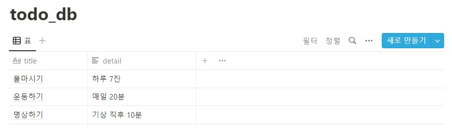

# TODO 리스트 with 노션 API
사용 기술 : 노션 API + node.js + express + JS (vanilla Javascript)
  

## 작업기록
[작업기록 보러가기](https://rosylog.tistory.com)

## 사용법(작성중)
1. 개발환경 세팅하기
2. todo App 개발하기
3. Notion API 등록하기
4. Notion API와 todo App 연결하기

---
# TODO List with Notion API as DB
Notion API + node.js + express + vanillaJS  
  
## WorkLog
[visit my techblog!](https://rosylog.tistory.com)

## How to Use(To Be Done)
1. Setup dev environment
2. Make todo webapp
3. Register Notion API
4. Connect Notion API to todo webapp

